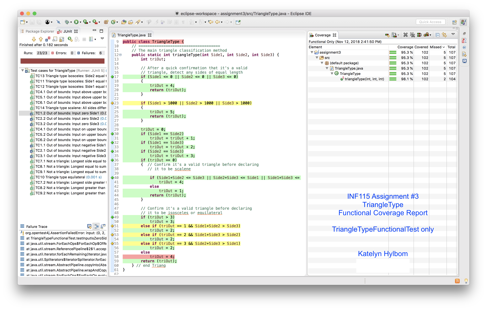

Given a class `TriangleType` construct a test suite of functional test cases. Using EclEmma plugin for Eclipse, assess coverage by functional tests and construct additional test cases to ensure complete code coverage.

### Coverage report: 
`TriangleTypeFunctionalTest`

### Complete coverage report: 
`TriangleTypeFunctionalTest` and `TriangleTypeStructuralTest`

